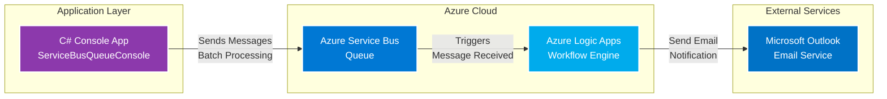

# Description
This is a CSharp (C#) 🟪 to integrate service bus queue 🧩 → 🚌📥 → 🧩. This is in order to study and practice for az204 certification exam 🤓📚🎓

# Made With
[![C#](https://img.shields.io/badge/c%23-8c39ac?style=for-the-badge&logo=data:image/svg+xml;base64,PD94bWwgdmVyc2lvbj0iMS4wIiBlbmNvZGluZz0iVVRGLTgiPz4KPHN2ZyBpZD0iTGF5ZXJfMSIgZGF0YS1uYW1lPSJMYXllciAxIiB4bWxucz0iaHR0cDovL3d3dy53My5vcmcvMjAwMC9zdmciIHZlcnNpb249IjEuMSIgdmlld0JveD0iMCAwIDIyMjIgMjUwMCI+CiAgPGRlZnM+CiAgICA8c3R5bGU+CiAgICAgIC5jbHMtMSB7CiAgICAgICAgZmlsbDogIzMzMzsKICAgICAgfQoKICAgICAgLmNscy0xLCAuY2xzLTIsIC5jbHMtMywgLmNscy00IHsKICAgICAgICBzdHJva2Utd2lkdGg6IDBweDsKICAgICAgfQoKICAgICAgLmNscy0yIHsKICAgICAgICBmaWxsOiAjNjY2OwogICAgICB9CgogICAgICAuY2xzLTMgewogICAgICAgIGZpbGw6ICMwMDA7CiAgICAgIH0KCiAgICAgIC5jbHMtNCB7CiAgICAgICAgZmlsbDogI2ZmZjsKICAgICAgfQogICAgPC9zdHlsZT4KICA8L2RlZnM+CiAgPHBhdGggY2xhc3M9ImNscy0yIiBkPSJNMjIxMi4xLDc0MC4xYzAtNDEuNi04LjktNzguNC0yNi45LTExMC0xNy43LTMxLTQ0LjItNTcuMS03OS43LTc3LjYtMjkzLjItMTY5LjEtNTg2LjctMzM3LjYtODc5LjgtNTA2LjktNzktNDUuNi0xNTUuNi00My45LTIzNC4xLDIuMy0xMTYuNyw2OC44LTcwMSw0MDMuNi04NzUuMSw1MDQuNC03MS43LDQxLjUtMTA2LjYsMTA1LTEwNi42LDE4Ny42LS4xLDM0MCwwLDY4MC0uMSwxMDIwLDAsNDAuNyw4LjUsNzYuOCwyNS43LDEwNy45LDE3LjcsMzIsNDQuNSw1OC43LDgwLjksNzkuNywxNzQuMSwxMDAuOSw3NTguNSw0MzUuNiw4NzUuMiw1MDQuNCw3OC41LDQ2LjMsMTU1LjEsNDgsMjM0LjEsMi4zLDI5My4xLTE2OS4yLDU4Ni42LTMzNy44LDg3OS45LTUwNi45LDM2LjMtMjEsNjMuMi00Ny44LDgwLjktNzkuNywxNy4yLTMxLjEsMjUuNy02Ny4yLDI1LjctMTA3LjksMCwwLDAtNjc5LjgtLjEtMTAxOS44Ii8+CiAgPHBhdGggY2xhc3M9ImNscy0zIiBkPSJNMTExNC40LDEyNDYuN0wzNS41LDE4NjcuOWMxNy43LDMyLDQ0LjUsNTguNyw4MC45LDc5LjcsMTc0LjEsMTAwLjksNzU4LjUsNDM1LjYsODc1LjIsNTA0LjQsNzguNSw0Ni4zLDE1NS4xLDQ4LDIzNC4xLDIuMywyOTMuMS0xNjkuMiw1ODYuNi0zMzcuOCw4NzkuOS01MDYuOSwzNi4zLTIxLDYzLjItNDcuOCw4MC45LTc5LjdsLTEwNzIuMS02MjEuMWgwWiIvPgogIDxwYXRoIGNsYXNzPSJjbHMtMSIgZD0iTTIyMTIuMSw3NDAuMWMwLTQxLjYtOC45LTc4LjQtMjYuOS0xMTBsLTEwNzAuOCw2MTYuNiwxMDcyLjEsNjIxLjFjMTcuMi0zMS4xLDI1LjctNjcuMiwyNS43LTEwNy45LDAsMCwwLTY3OS44LS4xLTEwMTkuOCIvPgogIDxnPgogICAgPHBhdGggY2xhc3M9ImNscy00IiBkPSJNMTc0OS42LDEwMTQuNXYxMTYuMWgxMTYuMXYtMTE2LjFoNTguMXYxMTYuMWgxMTYuMXY1OC4xaC0xMTYuMXYxMTYuMWgxMTYuMXY1OC4xaC0xMTYuMXYxMTYuMWgtNTguMXYtMTE2LjFoLTExNi4xdjExNi4xaC01OC4xdi0xMTYuMWgtMTE2LjF2LTU4LjFoMTE2LjF2LTExNi4xaC0xMTYuMXYtNTguMWgxMTYuMXYtMTE2LjFoNTguMVpNMTg2NS43LDExODguNmgtMTE2LjF2MTE2LjFoMTE2LjF2LTExNi4xWiIvPgogICAgPHBhdGggY2xhc3M9ImNscy00IiBkPSJNMTExNi43LDQzMS4zYzMwMi45LDAsNTY3LjMsMTY0LjUsNzA4LjksNDA5bC0xLjQtMi40LTM1Ni4zLDIwNS4yYy03MC4yLTExOC45LTE5OC45LTE5OS4xLTM0Ni41LTIwMC43aC00LjdjLTIyNS4xLDAtNDA3LjYsMTgyLjUtNDA3LjYsNDA3LjZzMTguNSwxNDAuNyw1My44LDIwMi4zYzcwLjMsMTIyLjcsMjAyLjQsMjA1LjQsMzUzLjksMjA1LjRzMjg1LjMtODMuOCwzNTUuMi0yMDcuOGwtMS43LDMsMzU1LjgsMjA2LjFjLTE0MC4xLDI0Mi40LTQwMC45LDQwNi40LTcwMC4yLDQwOS42aC05LjFjLTMwMy44LDAtNTY5LTE2NS40LTcxMC4yLTQxMS4yLTY5LTEyMC0xMDguNC0yNTkuMS0xMDguNC00MDcuNCwwLTQ1Mi4xLDM2Ni41LTgxOC43LDgxOC43LTgxOC43aC0uMloiLz4KICA8L2c+Cjwvc3ZnPg==&logoColor=white&labelColor=000000)]()

[![Azure](https://img.shields.io/badge/Azure-2b83cb?style=for-the-badge&logo=data:image/svg+xml;base64,PD94bWwgdmVyc2lvbj0iMS4wIiBlbmNvZGluZz0iVVRGLTgiPz4KPHN2ZyBpZD0iTGF5ZXJfMSIgeG1sbnM9Imh0dHA6Ly93d3cudzMub3JnLzIwMDAvc3ZnIiB2ZXJzaW9uPSIxLjEiIHZpZXdCb3g9IjAgMCA4MDAgODAwIj4KICA8IS0tIEdlbmVyYXRvcjogQWRvYmUgSWxsdXN0cmF0b3IgMjkuNS4xLCBTVkcgRXhwb3J0IFBsdWctSW4gLiBTVkcgVmVyc2lvbjogMi4xLjAgQnVpbGQgMTQxKSAgLS0+CiAgPGRlZnM+CiAgICA8c3R5bGU+CiAgICAgIC5zdDAgewogICAgICAgIGZpbGw6ICNmZmY7CiAgICAgIH0KICAgIDwvc3R5bGU+CiAgPC9kZWZzPgogIDxwYXRoIGNsYXNzPSJzdDAiIGQ9Ik0zNzAuMSw2NzUuNmMxMDIuOC0xOC4yLDE4Ny43LTMzLjIsMTg4LjYtMzMuNGwxLjgtLjQtOTctMTE1LjRjLTUzLjQtNjMuNS05Ny0xMTUuNy05Ny0xMTYsMC0uNiwxMDAuMi0yNzYuNSwxMDAuOC0yNzcuNS4yLS4zLDY4LjQsMTE3LjQsMTY1LjMsMjg1LjQsOTAuNywxNTcuMywxNjUuNSwyODYuOSwxNjYuMiwyODguMWwxLjMsMi4yaC0zMDguNHMtMzA4LjQsMC0zMDguNCwwbDE4Ni45LTMzaDBaTTAsNjQwLjRjMC0uMiw0NS43LTc5LjUsMTAxLjYtMTc2LjRsMTAxLjYtMTc2LjEsMTE4LjQtOTkuNGM2NS4xLTU0LjcsMTE4LjYtOTkuNCwxMTguOC05OS41LjIsMC0uNiwyLjEtMS45LDQuOC0xLjMsMi43LTU5LjEsMTI2LjgtMTI4LjYsMjc1LjhsLTEyNi4zLDI3MC44aC05MS44QzQxLjMsNjQwLjcsMCw2NDAuNiwwLDY0MC40SDBaIi8+Cjwvc3ZnPg==&logoColor=white&labelColor=000000)]()

## Architecture

This project demonstrates an enterprise messaging pattern using Azure Service Bus as a reliable message broker between different Azure services and external systems.

### Architecture Diagram

### Components

#### 1. **C# Console Application** 
- **Technology**: .NET 8.0
- **SDK**: `Azure.Messaging.ServiceBus` 
- **Purpose**: Producer application that sends messages to Azure Service Bus Queue
- **Features**:
  - Batch message processing
  - Configuration via environment variables
  - Async/await pattern for optimal performance
  - Proper resource disposal with IDisposable pattern

#### 2. **Azure Service Bus Queue**
- **Purpose**: Reliable message broker for asynchronous communication
- **Benefits**:
  - Message durability and persistence
  - FIFO (First-In-First-Out) delivery
  - Dead-letter queue support
  - Automatic retry policies
  - Load leveling and buffering

#### 3. **Azure Logic Apps**
- **Purpose**: Serverless workflow orchestration
- **Trigger**: Service Bus Queue message received
- **Action**: Process message and send email via Outlook connector
- **Benefits**:
  - No-code/low-code integration
  - Built-in connectors for 200+ services
  - Automatic scaling
  - Enterprise integration patterns

#### 4. **Microsoft Outlook**
- **Purpose**: Email notification delivery
- **Integration**: Via Logic Apps Outlook connector
- **Use Case**: Send notifications based on queue messages

### Message Flow

1. **Message Creation**: C# console app creates batch of messages
2. **Queue Submission**: Messages are sent to Azure Service Bus Queue using SDK
3. **Message Persistence**: Service Bus stores messages reliably
4. **Logic App Trigger**: Logic App detects new message in queue
5. **Email Processing**: Logic App processes message content
6. **Notification Delivery**: Outlook connector sends email to recipients

### Configuration

The application uses environment variables for configuration:

| Variable | Description | Example |
|----------|-------------|---------|
| `SERVICE_BUS_CONNECTION_STRING` | Azure Service Bus connection string | `Endpoint=sb://...` |
| `SERVICE_BUS_QUEUE_NAME` | Queue name | `myqueue` |

### Design Patterns

- **Message Batching**: Improves throughput by sending multiple messages in one operation
- **Async/Await**: Non-blocking I/O for better resource utilization
- **Dispose Pattern**: Proper cleanup of Azure SDK resources
- **Environment-based Configuration**: 12-factor app principles

### Benefits of This Architecture

✅ **Decoupling**: Services communicate via message queue, not direct calls  
✅ **Reliability**: Messages are persisted and guaranteed delivery  
✅ **Scalability**: Each component can scale independently  
✅ **Resilience**: Built-in retry policies and error handling  
✅ **Integration**: Easy to add new consumers without changing producer  
✅ **Monitoring**: Azure Monitor integration for observability